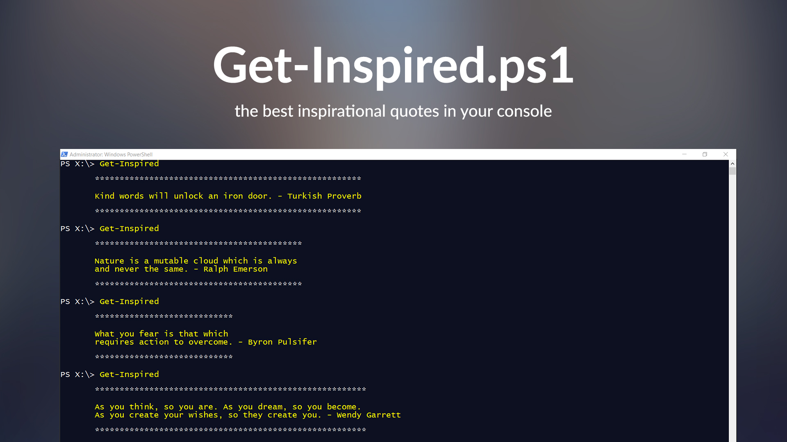

# Get-Inspired
The best inspirational quotes, right in your Powershell console.

[](https://gitter.im/Zhouzi/TheaterJS?utm_source=badge&utm_medium=badge&utm_campaign=pr-badge&utm_content=badge)




## Contents
- [**Installation**](##installation)
- [**Usage**](##usage)
- [**Notes**](##notes)

## Installation

* git clone https://github.com/LaureKamalandua/get-inspired.git

## Usage
Run the script from your shell to get a random quote.
```powershell
PS C:\System32\> .\Get-Inspiration.ps1

       ***************************************************
       
       My mama always said: life's like a box of chocolate
       — you never know what you gonna get.- Forrest Gump
      
       ***************************************************
       
```
Run the Start-Init function to add the script to your Powershell profile. A new quote will be visible every time you open the shell.
```powershell
PS C:\Users\User\Downloads\get-inspired\> Import-Module -Name .\Get-Inspiration.ps1 
PS C:\Users\User\Downloads\get-inspired\> Start-Init
The Powershell profile exists and the module will be added.
The module has been succesfully added to your profile.
       
```

## Notes
If you don't have a Windows Powershell profile set up yet, I kindly point to [this](http://www.howtogeek.com/126469/how-to-create-a-powershell-profile/) link.

## Change Log

* [ ] port to bash for UNIX users
* [ ] enhance string formatting
* [ ] enable quotes with a greater character length than 180 


## Credits

Built with ❤ by [Laure Kamalandua](http://laurekamalandua.com)<br>
Twitter: ([@laurekamalandua](http://twitter.com/laurekamalandua))<br>
Contact: [laure.kamalandua@gmail.com](mailto:laure.kamalandua@gmail.com)
